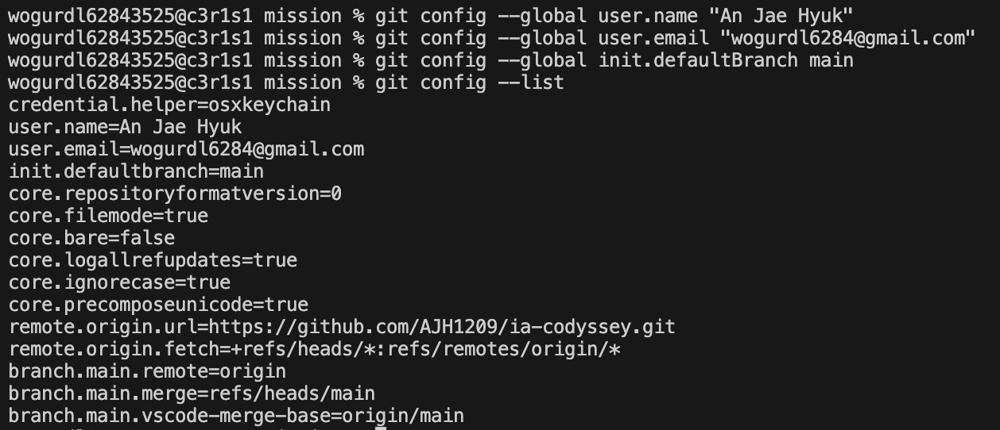
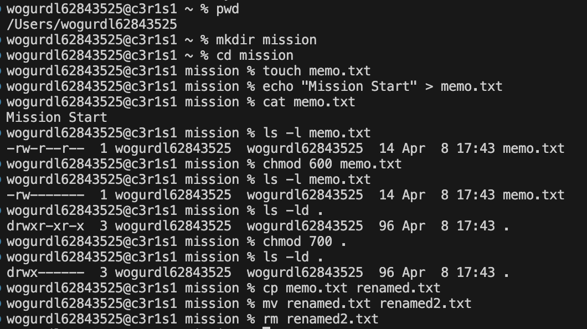
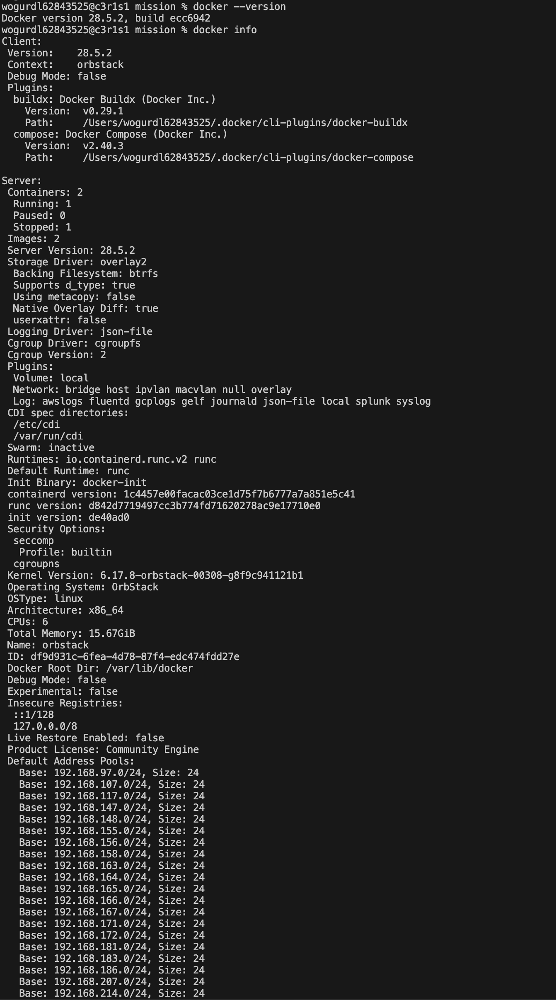
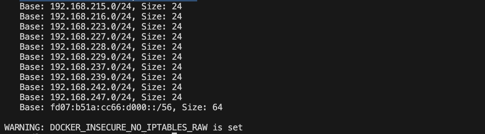
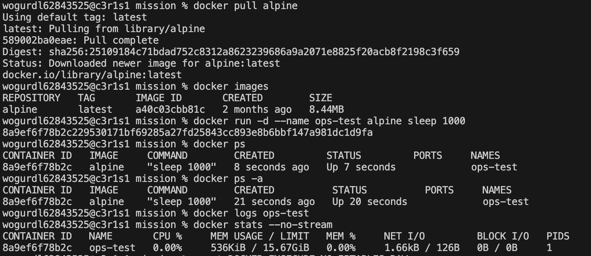
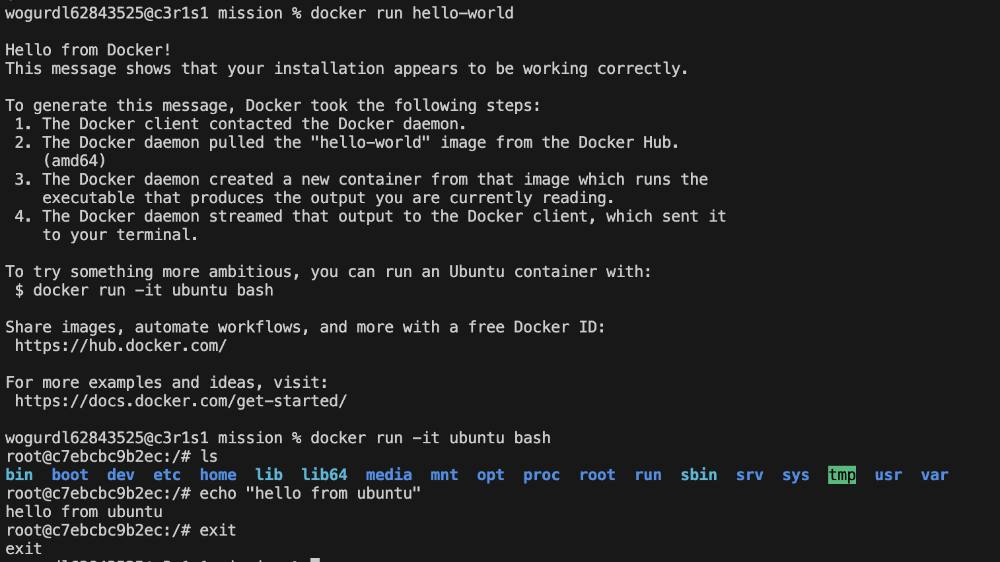
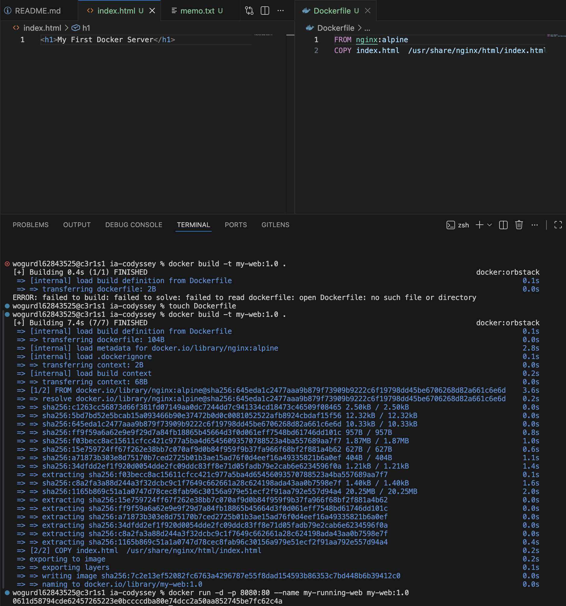
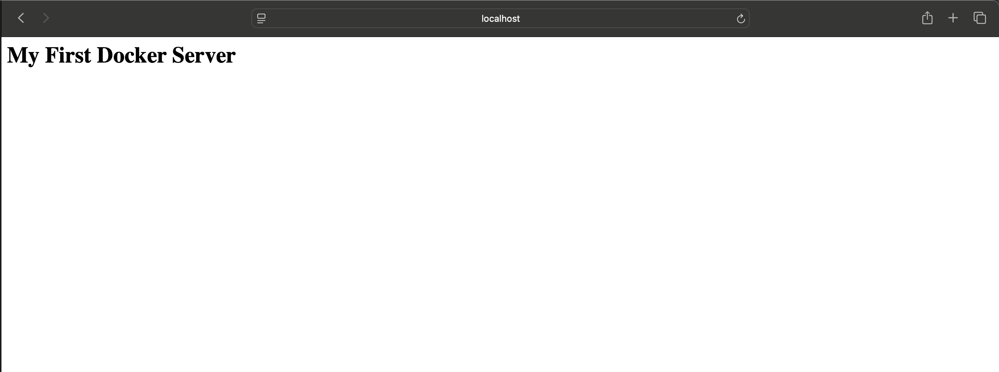
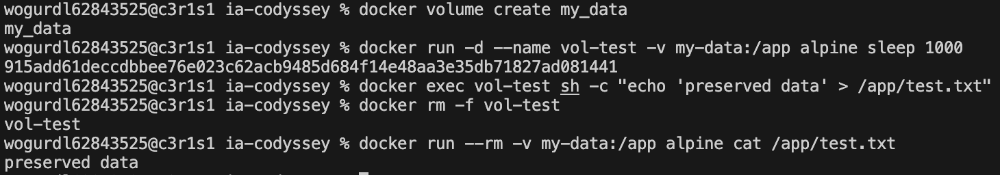

# ia-codyssey
Github와 Codyssey를 연동하기 위해 만들어진 Repository입니다.

# 실행 환경
- OS : macOS (OrbStack)
- Docker : 28.5.2
- Git : 2.53.0

# 수행 항목 체크 리스트
- [x] Git 설정 및 Github 연동
- [x] 터미널 조작 및 권한 실습
- [x] Docker 설치 점검 및 기본 명령
- [x] 컨테이너 실행 실습
- [x] Dockerfile 커스텀 이미지 제작
- [x] Docker 볼륨 영속성 검증
- [x] 트러블슈팅

# 터미널 조작 및 권한 실습 로그

- Git 설정 및 Github 연동

- 터미널 조작 및 권한 실습

- Docker 설치 점검 및 기본 명령

Docker 설치 점검 

Docker 이미지 및 컨테이너 운영

- 컨테이너 실행 실습

- Dockerfile 커스텀 이미지 제작

웹 서버 베이스 이미지 활용 (nginx)
기본 index.html을 사용자 정의 페이지로 교체하여 고유한 웹 서비스 제공
포트 매핑 : 호스트의 8080 포트를 컨테이너의 80 포트로 연결하여 외부 접속 허용

- Docker 볼륨 영속성 검증

컨테이너를 삭제한 후에도 생성한 볼륨이 유지되어, 새로 생성한
컨테이너에서도 기존 데이터가 정상적으로 조회됨을 확인

## 트러블슈팅

- 1. 문제: Docker 빌드 시 `Dockerfile: no such file or directory` 에러 발생
    - 원인 : 터미널 실행 경로가 프로젝트 폴더 외부(`~`)였음
    - 해결 : `cd ia-codyssey` 명령어로 파일이 위치한 폴더로 이동 후 재빌드 성공

- 2. 문제 : README 작성 후 Github에서 이미지가 보이지 않음 (엑박 현상 발생)
    - 원인 : 상대 경로 설정 시 중간 폴더(`mission`) 누락 및 확장자(`.png`) 미가입
    - 해결 : 경로를 `./mission/images/파일명.png`로 수정하여 해결